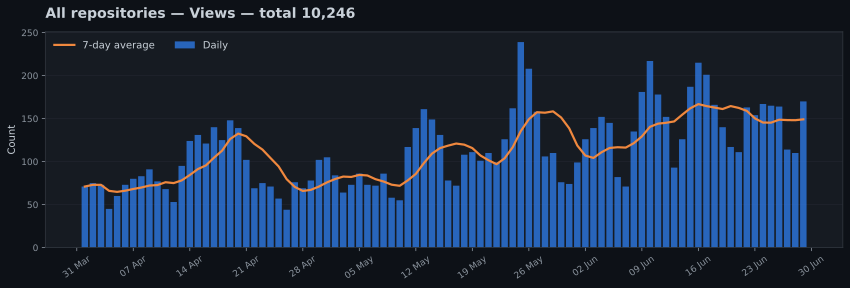
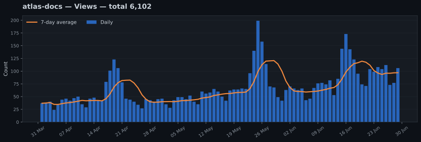
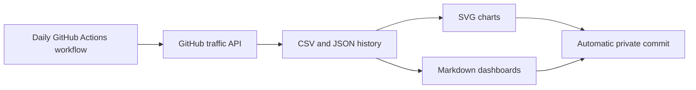

# GitHub Traffic Archive

Keep a private, long-term history of the traffic generated by all your public GitHub repositories.

GitHub normally exposes repository traffic for only the latest 14 days. This template runs once per day, archives that data permanently, generates SVG charts, and updates private Markdown dashboards automatically.

No server, terminal, local computer, or external analytics service is required after setup.

> [!IMPORTANT]
> This repository is the public template.  
> Your personal archive should be created from it as a **private repository**.

## Why use it?

GitHub Traffic Archive gives you:

- Long-term daily views
- Long-term daily unique-view counts
- Long-term daily clones
- Long-term daily unique-clone counts
- Top referring sites
- Most-viewed repository paths
- One dashboard for every repository
- One combined dashboard for your entire account
- Permanent CSV and JSON history
- Private SVG charts rendered directly by GitHub
- Automatic daily updates through GitHub Actions

Your data stays inside your own private GitHub repository.

## Explore the generated demo

The following example is generated by the same code used for real traffic archives.

> [!NOTE]
> Every repository name, date, traffic figure, referring site, and repository path shown in this demo is fictional.

### Combined account dashboard

**[Open the complete generated dashboard →](docs/demo/README.md)**

[](docs/demo/README.md)

The combined dashboard includes:

- Account-wide traffic totals
- Long-term views and clone charts
- Repository rankings
- Combined referring sites
- Most-viewed repository paths

### Individual repository dashboard

**[Open the complete `atlas-docs` repository dashboard →](docs/demo/data/repos/atlas-docs/README.md)**

[](docs/demo/data/repos/atlas-docs/README.md)

Every tracked repository receives its own:

- Traffic summary
- Long-term views chart
- Long-term unique-views chart
- Long-term clones chart
- Long-term unique-clones chart
- Referring-sites table
- Popular-paths table

### Inspect the generated archive

The demo exposes the same files created in a real private archive:

- [Permanent daily traffic CSV](docs/demo/data/repos/atlas-docs/traffic.csv)
- [Example referring-site snapshot](docs/demo/data/repos/atlas-docs/referrers/2026-06-30.json)
- [Example popular-path snapshot](docs/demo/data/repos/atlas-docs/paths/2026-06-30.json)
- [All fictional repository data](docs/demo/data/repos/)

## Setup

The installation takes four main steps:

1. Click **Use this template**.
2. Create a new **private** repository.
3. Create a fine-grained token with `Administration: Read-only`.
4. Save it as the `TRAFFIC_TOKEN` Actions secret and run the workflow.

No username needs to be entered in the configuration. The workflow detects the owner of the archive automatically.

**[Open the complete step-by-step setup guide](docs/SETUP.md)**

## How it works



Every run:

1. Discovers the public repositories owned by your account.
2. Filters forks, archived repositories, and configured exclusions.
3. Retrieves the latest traffic window from GitHub.
4. Updates existing UTC dates instead of duplicating them.
5. Saves dated referrer and popular-path snapshots.
6. Regenerates all charts and dashboards.
7. Commits only when generated data changed.

The archive repository itself is excluded automatically.

## Collected data

### Permanent daily history

Each repository receives a `traffic.csv` file:

```csv
date,views,unique_views,clones,unique_clones
2026-07-26,55,49,3,3
2026-07-27,29,20,2,2
```

The UTC date is the unique key. Running the workflow several times on the same day updates the existing row rather than creating a duplicate.

### Referrers and popular paths

GitHub returns the current top referring sites and popular paths for a rolling traffic window.

The project stores each result as a dated JSON snapshot:

```text
data/repos/repository-name/
├── referrers/
│   └── YYYY-MM-DD.json
└── paths/
    └── YYYY-MM-DD.json
```

These snapshots are displayed as current rankings. They are not added together because consecutive windows overlap.

## Generated structure

```text
README.md
charts/
├── total-views.svg
├── total-unique-views.svg
├── total-clones.svg
└── total-unique-clones.svg

data/
└── repos/
    └── repository-name/
        ├── README.md
        ├── traffic.csv
        ├── charts/
        │   ├── views.svg
        │   ├── unique-views.svg
        │   ├── clones.svg
        │   └── unique-clones.svg
        ├── referrers/
        └── paths/
```

## Configuration

The default `config.yaml` is:

```yaml
repositories:
  include_forks: false
  include_archived: false
  exclude: []
```

Repositories can be excluded by name:

```yaml
repositories:
  include_forks: false
  include_archived: false

  exclude:
    - old-project
    - test-repository
```

Configuration changes apply during the next workflow run.

## Privacy and security

The project uses two separate credentials:

| Credential | Purpose |
|---|---|
| `TRAFFIC_TOKEN` | Reads traffic statistics from your public repositories |
| Workflow `GITHUB_TOKEN` | Writes generated files into the archive repository |

The fine-grained `TRAFFIC_TOKEN` requires:

```text
Repository access: All repositories
Administration: Read-only
Metadata: Read-only
```

The collector still selects only public repositories.

The token:

- Is stored as an encrypted GitHub Actions secret
- Is never committed
- Is not displayed in dashboards
- Is not sent to an external service
- Is not used to modify tracked repositories

The archive repository should remain private because it contains referrers, popular paths, and historical traffic data.

## GitHub Actions usage and cost

A workflow run lasting approximately 30 seconds is billed as one full minute in a private repository because GitHub rounds each job up to the next whole minute.

With one run per day:

| Period | Approximate usage |
|---|---:|
| 28-day month | 28 minutes |
| 30-day month | 30 minutes |
| 31-day month | 31 minutes |
| One year | 365 minutes |

Current included private-repository allowances:

| Plan | Included minutes per month |
|---|---:|
| GitHub Free | 2,000 |
| GitHub Pro | 3,000 |

A 31-day month therefore uses approximately:

```text
31 / 2,000 = 1.55%
```

Expected additional cost while remaining within the included allowance:

```text
0 USD
```

Standard GitHub-hosted runners are free in public repositories, but a public archive would expose the collected analytics and is therefore not recommended.

After the included allowance is exhausted, the current standard two-core Linux runner rate is:

```text
0.006 USD per minute
```

Pricing may change. See the current GitHub documentation:

- https://docs.github.com/en/billing/concepts/product-billing/github-actions
- https://docs.github.com/en/billing/reference/actions-runner-pricing
- https://docs.github.com/en/billing/reference/product-usage-included

## Important limitations

### Historical recovery

GitHub exposes only the latest traffic window. The first run can archive the data currently available, but cannot reconstruct older traffic.

### Unique visitors

GitHub provides daily unique counts but does not expose visitor identities.

A person visiting on several days may therefore be counted once on each day. The same person visiting several repositories may also be counted once per repository.

For this reason, the dashboards describe these figures as sums of daily unique counts, not all-time distinct people.

### Referrers and paths

Referrers and popular paths are rolling top-entry snapshots, not complete additive daily histories.

### Supported ownership

The current version targets public repositories owned by one personal GitHub account. Organization repositories are not currently included.

## Schedule

The workflow runs every day at:

```text
03:17 UTC
```

It can also be started manually from:

```text
Actions
→ Collect GitHub traffic
→ Run workflow
```

Scheduled GitHub Actions jobs may occasionally begin later during periods of high demand. The overlapping traffic window allows later runs to recover recent dates.

## Documentation

- **[Complete setup and maintenance guide](docs/SETUP.md)**
- [GitHub traffic API documentation](https://docs.github.com/en/rest/metrics/traffic)
- [Fine-grained personal access tokens](https://docs.github.com/en/authentication/keeping-your-account-and-data-secure/managing-your-personal-access-tokens)
- [GitHub Actions billing](https://docs.github.com/en/billing/concepts/product-billing/github-actions)

## License

Released under the [MIT License](LICENSE).
