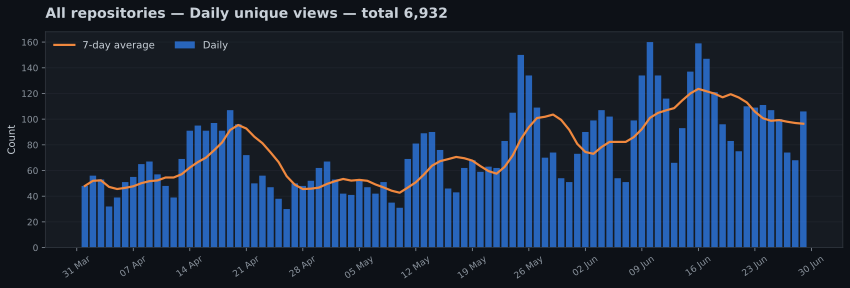
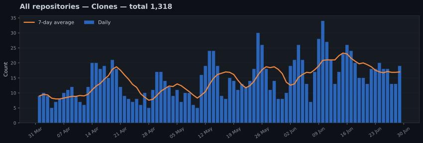
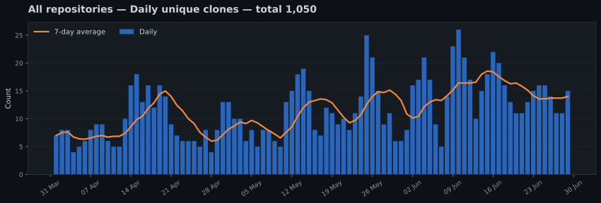

# GitHub Traffic Archive — Generated Demo

> [!NOTE]
> This is a generated demonstration. All repository names, dates, traffic figures, referrers, and paths shown here are fictional.

[Back to the project overview](../../README.md)

Generated example of the combined long-term analytics dashboard.

[Setup and maintenance guide](../SETUP.md)

**Repositories tracked:** 3  
**Stored period:** `2026-04-01` to `2026-06-29`  
**Last collection:** `2026-06-30 UTC`

## Combined traffic summary

| Metric | Since tracking began | Latest 14 stored dates |
|---|---:|---:|
| Views | 10,246 | 2,157 |
| Sum of daily unique-view counts | 6,932 | 1,466 |
| Clones | 1,318 | 250 |
| Sum of daily unique-clone counts | 1,050 | 204 |

> [!NOTE]
> Unique counts are supplied per repository and per day. They cannot be deduplicated across different days or repositories because GitHub does not expose visitor identities.

## Long-term views

## Long-term unique views

## Long-term clones

## Long-term unique clones

## Repository ranking

| Repository | Views | Daily unique-view counts | Clones | Daily unique-clone counts | Stored period |
|---|---:|---:|---:|---:|---|
| [atlas-docs](data/repos/atlas-docs/README.md) | 6,102 | 4,131 | 537 | 426 | `2026-04-01` to `2026-06-29` |
| [release-radar](data/repos/release-radar/README.md) | 3,202 | 2,150 | 543 | 428 | `2026-04-01` to `2026-06-29` |
| [tiny-cli](data/repos/tiny-cli/README.md) | 942 | 651 | 238 | 196 | `2026-04-01` to `2026-06-29` |

## Combined top referring sites

These values combine each repository's latest rolling traffic snapshot. They are not deduplicated.

| Referring site | Views | Summed unique counts |
|---|---:|---:|
| Google | 698 | 558 |
| github.com | 277 | 162 |
| DuckDuckGo | 142 | 115 |
| Hacker News | 67 | 61 |
| Reddit | 54 | 47 |
| Bing | 42 | 34 |

## Most-viewed repository paths

These are the highest reported paths from each repository's latest rolling traffic snapshot.

| Repository | Path | Page title | Views | Unique visitors |
|---|---|---|---:|---:|
| [atlas-docs](data/repos/atlas-docs/README.md) | `/demo-user/atlas-docs` | Overview | 512 | 421 |
| [release-radar](data/repos/release-radar/README.md) | `/demo-user/release-radar` | Overview | 226 | 174 |
| [atlas-docs](data/repos/atlas-docs/README.md) | `/demo-user/atlas-docs/blob/main/README.md` | README | 194 | 153 |
| [release-radar](data/repos/release-radar/README.md) | `/demo-user/release-radar/blob/main/README.md` | README | 91 | 69 |
| [atlas-docs](data/repos/atlas-docs/README.md) | `/demo-user/atlas-docs/tree/main/docs` | Documentation | 83 | 67 |
| [tiny-cli](data/repos/tiny-cli/README.md) | `/demo-user/tiny-cli` | Overview | 61 | 47 |
| [release-radar](data/repos/release-radar/README.md) | `/demo-user/release-radar/releases` | Releases | 53 | 44 |
| [atlas-docs](data/repos/atlas-docs/README.md) | `/demo-user/atlas-docs/releases` | Releases | 49 | 41 |
| [tiny-cli](data/repos/tiny-cli/README.md) | `/demo-user/tiny-cli/blob/main/README.md` | README | 27 | 22 |
| [tiny-cli](data/repos/tiny-cli/README.md) | `/demo-user/tiny-cli/releases` | Releases | 14 | 12 |

---

[Setup and maintenance guide](../SETUP.md)

_Generated automatically by `github-traffic-archive`._
