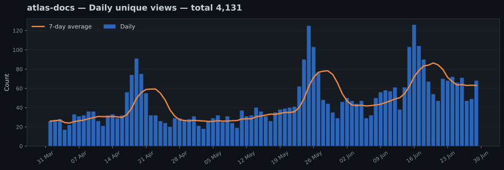
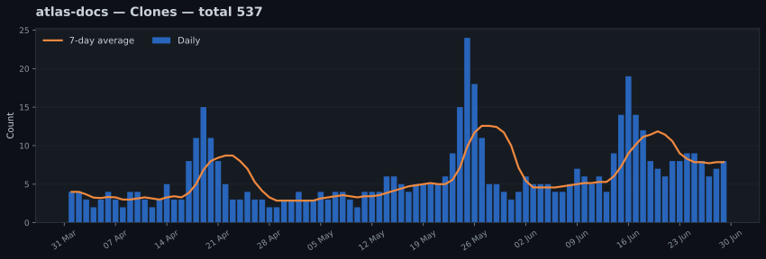
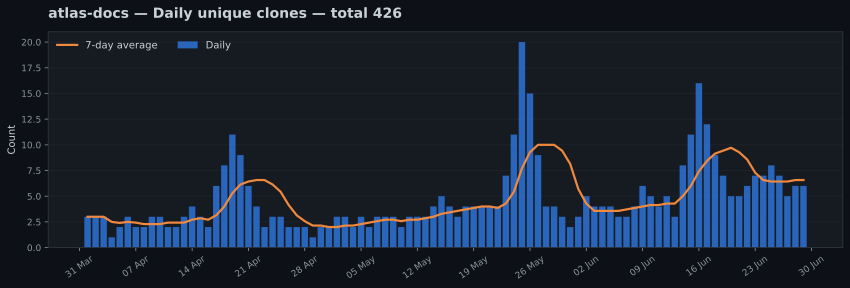

# atlas-docs

> [!NOTE]
> This is a generated demonstration. All repository names, dates, traffic figures, referrers, and paths shown here are fictional.

> Documentation portal for a fictional open-source mapping toolkit.

**Fictional repository:** this repository name and every displayed value are demonstration data.

[Back to combined dashboard](../../../README.md) · [Setup and maintenance guide](../../../../SETUP.md)

**Tracked period:** `2026-04-01` to `2026-06-29`  
**Last collection:** `2026-06-30 UTC`

## Traffic summary

| Metric | Since tracking began | Latest 14 stored days |
|---|---:|---:|
| Views | 6,102 | 1,462 |
| Sum of daily unique-view counts | 4,131 | 999 |
| Clones | 537 | 129 |
| Sum of daily unique-clone counts | 426 | 106 |

> [!NOTE]
> GitHub provides unique counts for each individual day, but does not provide visitor identities. The same person may therefore be counted again on another day or in another repository.

## Long-term views

## Long-term unique views

## Long-term clones

## Long-term unique clones

## Top referring sites

Latest rolling snapshot: `2026-06-30`

| Referring site | Views | Unique visitors |
|---|---:|---:|
| Google | 486 | 391 |
| github.com | 138 | 76 |
| DuckDuckGo | 91 | 74 |
| Hacker News | 67 | 61 |
| Bing | 42 | 34 |

## Most-viewed repository paths

Latest rolling snapshot: `2026-06-30`

| Repository path | Page title | Views | Unique visitors |
|---|---|---:|---:|
| `/demo-user/atlas-docs` | Overview | 512 | 421 |
| `/demo-user/atlas-docs/blob/main/README.md` | README | 194 | 153 |
| `/demo-user/atlas-docs/tree/main/docs` | Documentation | 83 | 67 |
| `/demo-user/atlas-docs/releases` | Releases | 49 | 41 |

---

[Back to combined dashboard](../../../README.md) · [Setup and maintenance guide](../../../../SETUP.md)

_Generated automatically by `github-traffic-archive`._
