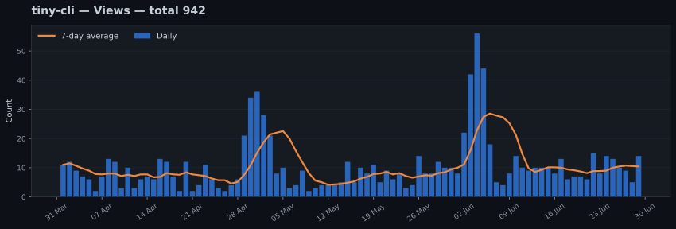
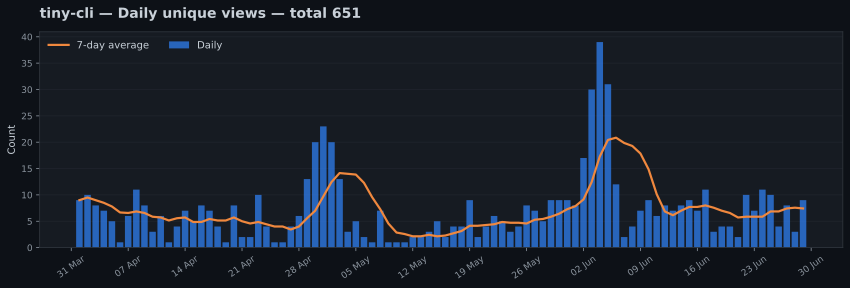
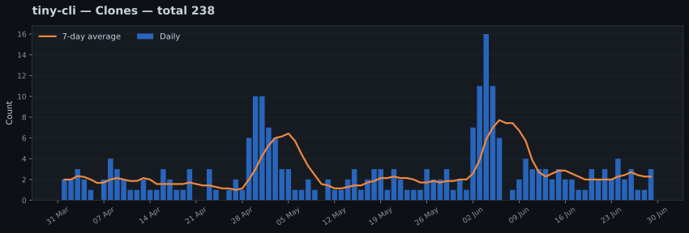
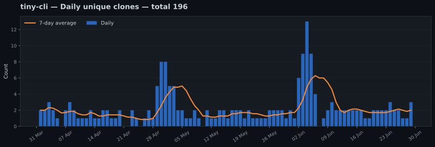

# tiny-cli

> [!NOTE]
> This is a generated demonstration. All repository names, dates, traffic figures, referrers, and paths shown here are fictional.

> Small fictional command-line utility used to demonstrate lower-volume repository traffic.

**Fictional repository:** this repository name and every displayed value are demonstration data.

[Back to combined dashboard](../../../README.md) · [Setup and maintenance guide](../../../../SETUP.md)

**Tracked period:** `2026-04-01` to `2026-06-29`  
**Last collection:** `2026-06-30 UTC`

## Traffic summary

| Metric | Since tracking began | Latest 14 stored days |
|---|---:|---:|
| Views | 942 | 135 |
| Sum of daily unique-view counts | 651 | 93 |
| Clones | 238 | 30 |
| Sum of daily unique-clone counts | 196 | 26 |

> [!NOTE]
> GitHub provides unique counts for each individual day, but does not provide visitor identities. The same person may therefore be counted again on another day or in another repository.

## Long-term views

## Long-term unique views

## Long-term clones

## Long-term unique clones

## Top referring sites

Latest rolling snapshot: `2026-06-30`

| Referring site | Views | Unique visitors |
|---|---:|---:|
| github.com | 43 | 28 |
| Google | 31 | 25 |
| DuckDuckGo | 12 | 10 |

## Most-viewed repository paths

Latest rolling snapshot: `2026-06-30`

| Repository path | Page title | Views | Unique visitors |
|---|---|---:|---:|
| `/demo-user/tiny-cli` | Overview | 61 | 47 |
| `/demo-user/tiny-cli/blob/main/README.md` | README | 27 | 22 |
| `/demo-user/tiny-cli/releases` | Releases | 14 | 12 |

---

[Back to combined dashboard](../../../README.md) · [Setup and maintenance guide](../../../../SETUP.md)

_Generated automatically by `github-traffic-archive`._
